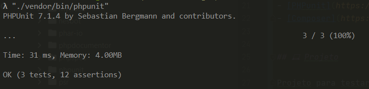

  <a href="#rocket-tecnologias">Tecnologias</a>&nbsp;&nbsp;&nbsp;|&nbsp;&nbsp;&nbsp;
  <a href="#-projeto">Projeto</a>&nbsp;&nbsp;&nbsp;|&nbsp;&nbsp;&nbsp;
  <a href="#-como-rodar">Como rodar</a>&nbsp;&nbsp;&nbsp;|&nbsp;&nbsp;&nbsp;
  <a href="#-como-contribuir">Como contribuir</a>&nbsp;&nbsp;&nbsp;
  

 

 

## Algarismos romanos

## 🚀 Tecnologias

Esse projeto foi desenvolvido com as seguintes tecnologias:

- [PHP](https://www.php.net/) - 7.1
- [PHPunit](https://phpunit.de/) - 7.1
- [Composer](https://phpunit.de/) - 1.10.1

## 💻 Projeto

Projeto para testar um codigo que "traduz" algarismo romano.

## 🚀 Como Rodar

- Clone o projeto.
- Execute composer install
- Execute o comando "./vendor/bin/phpunit" (com aspas) para executar os teste.
Caso queira alterar os teste use a classe /test/unit/AlgarismoRomanoTest.

  

## 🤔 Como contribuir

- Faça um fork desse repositório;
- Cria uma branch com a sua feature: `git checkout -b minha-feature`;
- Faça commit das suas alterações: `git commit -m 'feat: Minha nova feature'`;
- Faça push para a sua branch: `git push origin minha-feature`.

Depois que o merge da sua pull request for feito, você pode deletar a sua branch.

